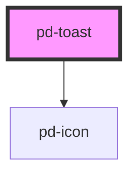

# pd-toast

<!-- Auto Generated Below -->

## Properties

| Property | Attribute | Description                                        | Type                 | Default     |
| -------- | --------- | -------------------------------------------------- | -------------------- | ----------- |
| `info`   | `info`    | Additional toast information (e.g. 11 minutes ago) | `string`             | `undefined` |
| `size`   | `size`    | Changes max-with of the toast                      | `"large" \| "small"` | `'large'`   |
| `title`  | `title`   | The Toast title                                    | `string`             | `undefined` |

## Events

| Event          | Description                                 | Type               |
| -------------- | ------------------------------------------- | ------------------ |
| `pd-on-closed` | When closing the toast using the close icon | `CustomEvent<any>` |

## Dependencies

### Depends on

- [pd-icon](../pd-icon)

### Graph

----------------------------------------------

*Built with [StencilJS](https://stenciljs.com/)*
